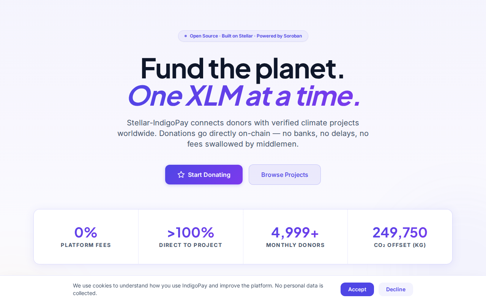
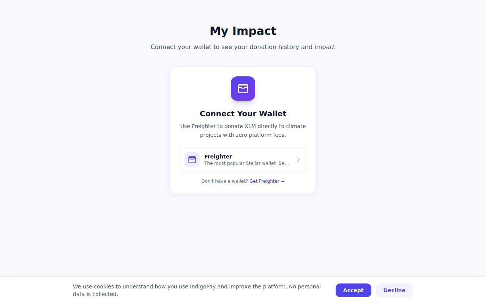
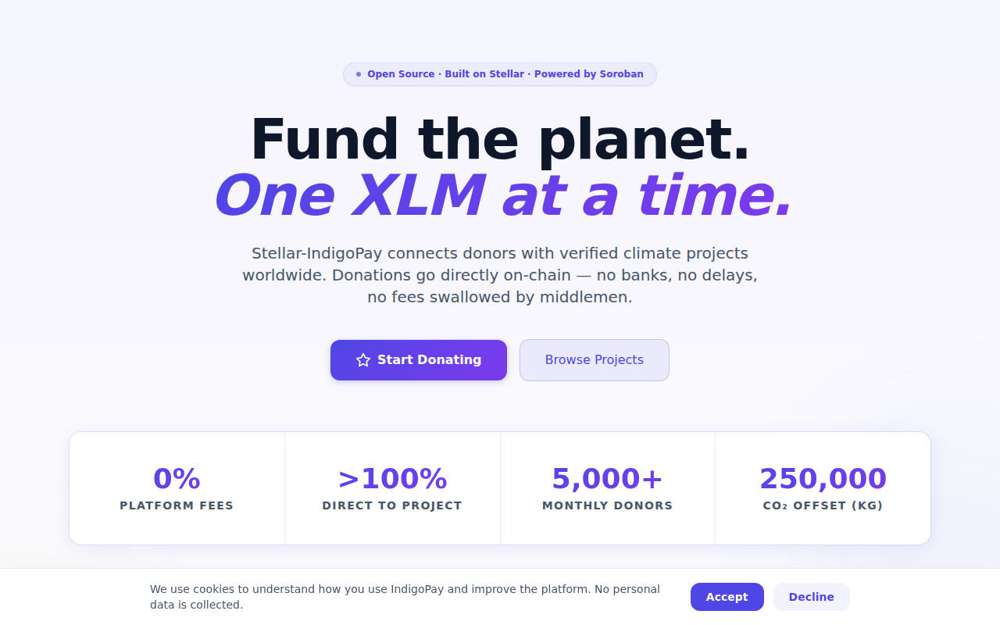
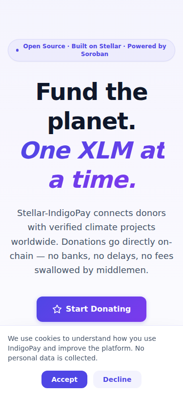
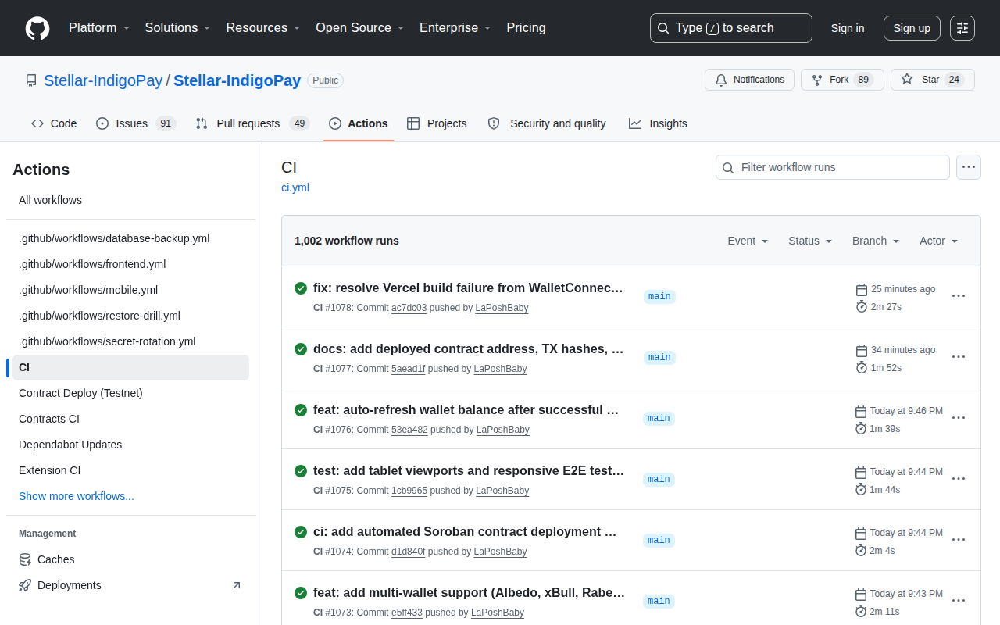
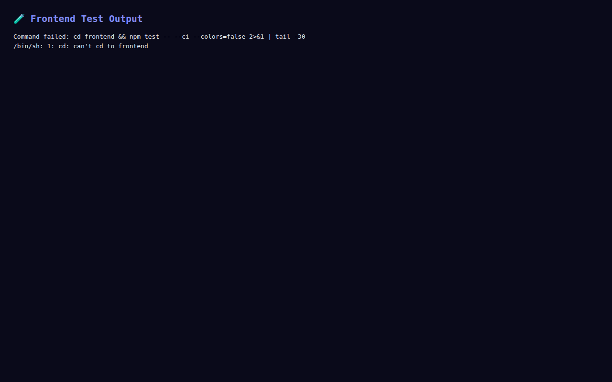

<div align="center">


[](LICENSE)
[](CONTRIBUTING.md)
[](CODE_OF_CONDUCT.md)
[](https://github.com/Stellar-IndigoPay/Stellar-IndigoPay/actions/workflows/ci.yml)
[](https://github.com/Stellar-IndigoPay/Stellar-IndigoPay/graphs/contributors)
[](https://github.com/Stellar-IndigoPay/Stellar-IndigoPay/actions/workflows/ci.yml)
[](https://github.com/Stellar-IndigoPay/Stellar-IndigoPay/tree/main/contracts)
[](https://github.com/Stellar-IndigoPay/Stellar-IndigoPay/actions/workflows/ci.yml)

[](https://stellar.org)
[](https://soroban.stellar.org)
[](https://stellar-indigo-pay.vercel.app)
[](https://stellar.expert/explorer/testnet/contract/CCG3QSD7FWTZ5W7NG2N7UDYWYVXF3I2NY5JGT3QPTZ6KHOIKUHMMJ6BT)
[](#-pitch-video)
[](https://nodejs.org)
[](https://www.typescriptlang.org)
[](https://react.dev)
[](https://nextjs.org)
[](https://docker.com)
[](https://rust-lang.org)
[](docs/gas-optimization.md)
[](https://kubernetes.io)
[](https://expo.dev)
[](https://t.me/StellarIndigoPay)

[**🌐 Live Demo**](https://stellar-indigo-pay.vercel.app) · [**📱 Mobile App**](mobile/) · [**🧩 Chrome Extension**](extension/) · [**📚 Docs**](docs/README.md) · [**💬 Telegram**](https://t.me/StellarIndigoPay) · [**🚀 Quick Start**](#-quick-start)

</div>

---

## ✨ What is Stellar-IndigoPay?

Stellar-IndigoPay is an **open-source climate donation platform** built on the Stellar network. Donors give XLM (and USDC) directly to verified environmental projects — funds never touch a custodian. Every donation is recorded on-chain via a [Soroban](https://soroban.stellar.org) smart contract, so total impact, donor reputation, and CO₂ offsets are **publicly auditable** by anyone, in any language, on any device.

The same platform ships as:

| Surface                  | What it is                                                                      | Built with                                 |
| ------------------------ | ------------------------------------------------------------------------------- | ------------------------------------------ |
| 🌐 **Web app**           | Donor dashboard, project browse, leaderboard, AI impact summaries, multi-wallet | Next.js 14 · React · TypeScript · Tailwind |
| 📱 **Mobile app**        | QR-scan-to-give, biometric auth, secure wallet storage, push receipts           | React Native · Expo · expo-router          |
| 🧩 **Browser extension** | Detect Stellar addresses on any page, donate in one click                       | Manifest V3 · Webpack (Chrome + Firefox)   |
| ⛓️ **4 Soroban contracts** | Donation ledger (138 codes), escrow (62), attestation (60), oracle (50) — **310 structured error codes** | Rust · WASM `wasm32v1-none`                |
| 🛠 **Backend API**        | Metadata, leaderboard, webhooks, AI summaries, admin, event streaming           | Node.js 22 · Express · Postgres · pg-boss  |

---

## 🎯 Why Stellar-IndigoPay?

- 🔐 **Custody-minimised** — XLM goes directly from donor wallet to project wallet. The platform never holds funds.
- 📜 **On-chain transparency** — Soroban is the single source of truth. Anyone can read `get_project()`, `get_donor_stats()`, `get_global_total()` without trusting us.
- 🪪 **No accounts** — your Stellar keypair is your identity. No email, no password, no recovery phone.
- 🏷 **Reputation you own** — Impact badges (🌱 Seedling, 🌳 Tree, 🌲 Forest, 🌍 Earth Guardian) and Impact NFTs are wallet-bound and travel with you across dApps.
- 💱 **Multi-currency** — Donate in XLM or USDC. USDC amounts are converted via a configurable on-chain price oracle.
- 🗳 **Community governance** — Badge holders vote to verify new projects using quadratic voting. On-chain proposals with configurable voting windows.
- 🤖 **AI impact summaries** — every project gets a plain-language explainer of where donations go, generated via Anthropic Claude and cached server-side.
- 🔔 **Webhooks for partners** — signed (HMAC-SHA256), retried (6-attempt backoff), dead-lettered milestone events.
- 🌉 **Cross-chain attestation** — verifiable on-chain records that a donation originated from another chain (Ethereum, Polygon, etc.).
- ⚡ **Real-time events** — SSE and Socket.IO streams for live donation ticker and Soroban contract event synchronization.
- 🛰 **Production-grade ops** — Helm, ArgoCD, Prometheus, Alertmanager with PagerDuty/Slack routing, monthly restore drills, SBOM + cosign signing.

---

## 🎥 Pitch Video

A 3-minute motion-graphics pitch with a neural voice-over, walking through the problem (opaque, fee-heavy giving), the solution (direct, custody-free, on-chain donations), the product tour, the Soroban engineering depth, community traction, and the call to action.

> **📹 Watch the 3-minute pitch:** [Download MP4](https://raw.githubusercontent.com/Stellar-IndigoPay/Stellar-IndigoPay/main/assets/pitch.mp4) (9.9 MB)
>
> **Script & tooling:** [`scripts/pitch-video-script.md`](scripts/pitch-video-script.md) · generated by [`scripts/pitch_video.py`](scripts/pitch_video.py)

---

## 🌐 Live Demo

**🔗 [stellar-indigo-pay.vercel.app](https://stellar-indigo-pay.vercel.app)**

The frontend is deployed on Vercel and connected to Stellar Testnet. You can browse projects, connect your Freighter wallet (switched to Testnet), and make test donations immediately — no local setup required.

| Item                        | Value                                                               |
| --------------------------- | ------------------------------------------------------------------- |
| 🌐 **Live URL**             | [stellar-indigo-pay.vercel.app](https://stellar-indigo-pay.vercel.app) |
| ⛓️ **Network**              | Stellar Testnet                                                     |
| 🏭 **Hosting**              | [Vercel](https://vercel.com)                                        |
| 🔑 **Wallet**               | [Freighter](https://freighter.app) (switch to Testnet)              |
| 💰 **Testnet XLM**          | [Friendbot](https://friendbot.stellar.org)                          |
| 📦 **Slim Contract ID (Testnet)** | [`CAPE7IB3...INPE2`](https://stellar.expert/explorer/testnet/contract/CAPE7IB3DRAXGEQIZSRXFOGRLSAY4M6GF4FX35436FYU7Q7PXYTINPE2) |
| 📦 **Optimized Contract ID (Testnet)** | [`CCG3QSD...J6BT`](https://stellar.expert/explorer/testnet/contract/CCG3QSD7FWTZ5W7NG2N7UDYWYVXF3I2NY5JGT3QPTZ6KHOIKUHMMJ6BT) |

---

## 🚀 Quick start

You can be donating on testnet in **under five minutes**.

### 1. Prerequisites

| Tool                                         | Version    | Why                                                                             |
| -------------------------------------------- | ---------- | ------------------------------------------------------------------------------- |
| Node.js                                      | **22 LTS** | Backend + frontend + mobile scripts                                             |
| npm                                          | 10+        | Package manager                                                                 |
| Docker + Docker Compose                      | Latest     | One-command dev environment                                                     |
| Freighter Wallet                             | Latest     | Stellar browser wallet (or [Freighter Mobile](https://freighter.app) on phones) |
| _(optional)_ Rust                            | 1.91+      | Only if you want to build the Soroban contracts                                 |

### 2. Clone & bootstrap

```bash
git clone https://github.com/Stellar-IndigoPay/Stellar-IndigoPay.git
cd Stellar-IndigoPay
chmod +x scripts/setup-dev.sh
./scripts/setup-dev.sh
```

The setup script installs Node deps for the backend, frontend, mobile, and extension and verifies the toolchain.

### 3. Run the full stack with Docker

```bash
docker compose -f docker-compose.yml -f docker-compose.dev.yml up --build
```

| Service             | URL                                          |
| ------------------- | -------------------------------------------- |
| 🖥 Frontend          | <http://localhost:3000>                      |
| 🛠 Backend API       | <http://localhost:4000>                      |
| 📜 Swagger UI       | <http://localhost:4000/api/docs>             |
| ❤️ Health           | <http://localhost:4000/api/health>           |
| 🗄 Postgres          | `localhost:5432` (`indigopay` / `indigopay`) |
| 📦 Redis (optional) | `localhost:6379`                             |

The `docker-compose.dev.yml` override mounts source code into the containers and enables hot-reload for both Next.js and Express. Source edits refresh in seconds.

### 4. Fund a testnet wallet

1. Install [Freighter](https://freighter.app) and switch it to **Testnet**
2. Copy your public key (starts with `G…`)
3. Visit `https://friendbot.stellar.org?addr=<YOUR_PUBLIC_KEY>` and you'll get 10 000 test XLM in a few seconds

### 5. Donate

- Open <http://localhost:3000>
- Click **Connect Wallet** → approve in Freighter
- Pick a project → enter an amount → sign the transaction in Freighter
- Refresh the dashboard — your donation is recorded both on-chain and in the backend

That's it. No account creation, no email verification, no KYC.

---

## 🏗 Architecture

```
                        ┌──────────────────────────────────┐
                        │        Donor (Freighter)         │
                        └─────┬───────────────┬────────────┘
                              │               │
              sign locally    │               │   scan QR
                              ▼               ▼
                ┌──────────────────────┐  ┌────────────────────┐
                │   Web (Next.js)      │  │  Mobile (Expo)     │
                │   Extension (MV3)    │  │                    │
                └────────┬─────────────┘  └────────┬───────────┘
                         │ REST + WebSocket        │
                         ▼                         ▼
              ┌─────────────────────────────────────────────┐
              │   Node.js Backend (Express, Postgres)       │
              │   • Project metadata & leaderboard          │
              │   • Donation record (durable, idempotent)   │
              │   • Webhook delivery (pg-boss + DLQ)        │
              │   • AI impact summaries (Anthropic)         │
              │   • Admin + audit log                       │
              │   • Sentry traces, Prometheus metrics        │
              └──┬──────────────────┬──────────────┬───────┘
                 │                  │              │
                 ▼                  ▼              ▼
        ┌────────────────┐  ┌────────────┐  ┌──────────────┐
        │  Postgres      │  │  Redis     │  │  Horizon /   │
        │  (durable      │  │  (cache)   │  │  Soroban RPC │
        │   ledger)      │  │            │  │  (indexer)   │
        └────────────────┘  └────────────┘  └──────┬───────┘
                                                   │
                                                   ▼
                                       ┌──────────────────────────────┐
                                       │  Soroban Contracts            │
                                       │  • IndigoPay (donation ledger)│
                                       │  • Escrow (milestone payouts) │
                                       │  • Attestation (cross-chain)  │
                                       │  • Oracle (price feed)        │
                                       │  Source of truth              │
                                       └──────────────────────────────┘
```

**Key design choices** (full rationale in [`docs/architecture.md`](docs/architecture.md)):

- **Direct-to-project payments** — funds flow donor → project wallet. The contract records the event; it never custodies funds.
- **Backend is optional** — if the API is down, donations still succeed; you just can't see the leaderboard.
- **Soroban is the source of truth** — the contract exposes 20+ read functions; the backend is a queryable cache.
- **Structured errors** — all 4 contracts use `#[contracterror]` enums (310 numeric codes total); no string-parsing needed for error handling.
- **Wallet-as-identity** — auth is `require_auth()` on the Stellar keypair. No password reset, no email enumeration.
- **Defense in depth** — NetworkPolicies (default-deny), `PodDisruptionBudget`, `HorizontalPodAutoscaler`, External Secrets, SBOM + Trivy + cosign, monthly restore drills.

---

## 🌟 Features in depth

### 🌐 Web app (`frontend/`)

- Browse verified projects with category, location, CO₂ offset, leaderboard rank
- Connect Freighter; sign donations locally — keys never leave the wallet
- Personal dashboard: lifetime donated, current badge, recent donations
- Project pages: campaign progress, milestones, ratings, **AI-generated impact summary**
- Real-time donation ticker + impact world map
- **Internationalisation**: English, French, Spanish ([`frontend/lib/i18n.tsx`](frontend/lib/i18n.tsx))
- Monthly giving setup with pause / cancel ([`frontend/lib/monthlyGiving.ts`](frontend/lib/monthlyGiving.ts))
- Project comparison + wishlist + autocomplete
- Wallet address QR generator, project QR donation

### 📱 Mobile app (`mobile/`)

- iOS + Android via a single React Native codebase
- **`expo-router`** file-based navigation
- **Biometric auth** for sensitive flows ([`mobile/hooks/useBiometricAuth.ts`](mobile/hooks/useBiometricAuth.ts))
- **Secure store** for cached secrets ([`mobile/lib/secureStore.ts`](mobile/lib/secureStore.ts))
- **QR donation** with camera ([`mobile/app/scan.tsx`](mobile/app/scan.tsx))
- Deep links for mobile wallets (`freighter://tx?xdr=…`)
- Push notifications for donation receipts and project updates
- Offline support with AsyncStorage-backed cache

### 🧩 Browser extension (`extension/`)

- **Manifest V3** for Chrome and Firefox ([`extension/manifest.json`](extension/manifest.json), [`extension/manifest.firefox.json`](extension/manifest.firefox.json))
- Detects Stellar addresses (matching `^G[A-Z0-9]{55}$`) on any web page
- Click the popup to send a donation to the detected address

### ⛓️ Soroban contracts (`contracts/`)

#### IndigoPay Contract (`contracts/indigopay-contract/`)

| Capability                | Entry points |
| ------------------------- | ------------ |
| **Project registry**      | `register_project`, `batch_register_projects`, `update_project_co2_rate`, `pause_project`, `resume_project`, `deactivate_project`, `deactivate_all_projects` |
| **Donations**             | `donate(XLM)`, `donate_usdc(…)` with on-chain price oracle; `create_recurring` / `cancel_recurring` for automated giving |
| **Campaigns**             | `create_campaign`, `extend_campaign_deadline`, `close_campaign` — time-bound fundraising with goal tracking |
| **Reputation & NFTs**     | `get_donor_stats`, `get_badge`, `mint_impact_nft` — tiered badges (🌱 Seedling → 🌍 Earth Guardian) |
| **Governance**            | `create_proposal`, `vote_verify_project`, `resolve_proposal` — quadratic voting gated by `≥ Seedling` badge |
| **Escrow integration**    | `setup_campaign_escrow`, `fund_escrow`, `release_escrow_milestone`, `claim_escrow_refund` — cross-contract calls to the escrow contract |
| **Attestation settlement**| `settle_attestation` — cross-contract recording of cross-chain donations verified by the attestation contract |
| **Emergency withdrawal**  | `initiate_emergency_withdrawal`, `execute_emergency_withdrawal` — timelocked multi-token batch withdrawal |
| **Vesting**               | `create_vesting_schedule`, `release_vesting`, `cancel_vesting` — time-locked token distribution |
| **Storage GC**            | `cleanup_vesting_cancelled`, `cleanup_proposals` — permissionless garbage collection for expired entries |
| **Fees**                  | `set_platform_fee`, `set_treasury`, `set_fee_recipient` — configurable fee splits |
| **Impact verification**   | `publish_impact_root`, `verify_impact_inclusion`, `get_impact_periods` — Merkle Mountain Range proofs for off-chain impact data |
| **ZK donations**          | `set_zk_verification_key`, `donate_zk` — privacy-preserving donations via zk-SNARK proofs (feature-gated) |
| **Admin & upgrades**      | `transfer_admin` → `accept_admin` (2-step), `pause_contract` / `unpause_contract`, `propose_upgrade` → 48h timelock → `execute_upgrade` |
| **Read (20+ functions)**  | `get_project`, `get_global_total`, `get_global_stats`, `get_donation_count`, `get_donation_record`, `get_project_count`, `get_campaign`, `get_voter_list`, and more |

#### Companion Contracts

| Contract | Path | Purpose |
|----------|------|---------|
| **Escrow** | `contracts/escrow-contract/` | Milestone-based fund release with multi-sig admin, dispute resolution, multi-token (XLM + USDC) support |
| **Attestation** | `contracts/attestation-contract/` | Cross-chain donation attestation bridge — records verifiable on-chain proofs that a donation originated on another chain |
| **Oracle** | `contracts/oracle-contract/` | On-chain price oracle for XLM/USDC conversion used by the IndigoPay contract's multi-currency donation flow |

#### Structured Error Codes

All four contracts use `#[contracterror]` enums with unique numeric codes — no string-based `panic!()` messages. Clients and indexers can match on error codes without parsing panic strings.

| Contract | Error Enum | Codes | Categories |
|----------|-----------|-------|------------|
| **IndigoPay** | `ContractError` + `VerificationError` | 136 | Init/admin, project, donation, campaign, token, attestation, escrow, governance, ZK, NFT, upgrade, emergency, refund, impact |
| **Escrow** | `EscrowError` | 64 | Init, job creation, amendment, release, oracle, disputes, refunds, claims, admin, job enumeration |
| **Attestation** | `AttestationError` | 60 | Init/admin, relayer, pause, validation, attestation lifecycle, upgrade, aggregation |
| **Oracle** | `OracleError` | 50 | Init/admin, staking, price reporting, config, source oracles, aggregation |
| **Total** | | **310** | |

Full details: [`contracts/indigopay-contract/README.md`](contracts/indigopay-contract/README.md) · [`contracts/indigopay-contract/SECURITY.md`](contracts/indigopay-contract/SECURITY.md) · [`contracts/indigopay-contract/UPGRADE.md`](contracts/indigopay-contract/UPGRADE.md)

### 🛠 Backend API (`backend/`)

- Express + Node 22 + zod env validation
- **Postgres** for durable storage (donations, profiles, projects, jobs, ratings, updates, subscriptions, webhooks, AI summaries)
- **pg-boss** for durable background jobs (webhook delivery, AI summaries, profile enrichment, digests)
- **Webhook delivery**: `webhookQueue` worker with 6-attempt backoff (30s → 2m → 10m → 30m → 2h → 6h), DLQ, GitHub-style `t=…,v1=…` HMAC-SHA256 signing, 5-min replay window, idempotency by event id ([`docs/webhook-receiver.md`](docs/webhook-receiver.md))
- **OpenAPI 3.0.3** spec served as Swagger UI at `/api/docs` ([`docs/api/openapi.yaml`](docs/api/openapi.yaml))
- **Sentry** error tracking + **Prometheus** metrics (`/metrics`, bearer-token auth in prod)
- **Socket.IO** for real-time donation ticker; **SSE** for Soroban contract event streaming
- **Admin console** with JWT + refresh tokens, audit log, project status changes
- **zod**-validated request payloads, **express-rate-limit** + **csurf**
- **Pino** structured logging, `X-Request-Id` correlation on every request
- **95% → 99.5% coverage thresholds** across backend, frontend, mobile, and extension
- Sentry + Prometheus + webhook + indexer **graceful shutdown** wired through a lifecycle service

### 🛰 Observability (`monitoring/`)

- **Prometheus** scrapes backend, indexer, and pg-boss job metrics
- **Grafana** dashboards with platform health, donation flow, AI cost, webhook health
- **Alertmanager** with **PagerDuty** + **Slack** + business-hours routing and inhibition rules
- Alert rules: 5xx rate, p99 latency, DB pool wait, slow query p99, readiness failing, `BackupMissed`, `RestoreDrillFailed`
- Docker Compose stack ([`monitoring/docker-compose.monitoring.yml`](monitoring/docker-compose.monitoring.yml)) and Helm chart integration

### 🔒 Security posture

- Default-deny **NetworkPolicy** in the `indigopay` namespace, with explicit allow rules
- HPA (min 2, max 10) + PDB (`minAvailable: 1`) on backend and frontend
- **External Secrets** operator template ([`k8s/external-secret.yaml`](k8s/external-secret.yaml), [`docs/external-secrets.md`](docs/external-secrets.md))
- **SBOM** on every push, **Trivy** image scan (informational), **cosign** keyless signing on release tags
- **Gitleaks** secret scan with a curated allowlist ([`.gitleaks.toml`](.gitleaks.toml))
- Rate limit + CSRF + helmet + CSP + Sentry error capture
- Audit log of every admin action with actor, target, IP, and metadata

### ⚡ Gas-optimized contracts

All four Soroban contracts are compiled with aggressive size optimization (`opt-level = "z"`, `lto = true`, `codegen-units = 1`, `strip = true`, `panic = "abort"`) and enforced by a **64 KB WASM size limit** in CI. Key savings:

| Strategy | Impact |
|----------|--------|
| **Feature gating** (16 Cargo features) | Slim deployment at **51 KB** vs 103 KB full; choose only what you need |
| **Shortened event symbols** (`symbol_short!`) | 33% smaller XDR encoding (8-9 bytes avg vs 12-15) |
| **Bundled reads** (`get_global_stats`) | 75% fewer RPC calls (1 vs 4) for dashboard hero |
| **Instance storage** for hot counters | Cheaper reads than persistent storage for admin threshold, global totals, pause flags |
| **Storage garbage collection** (`cleanup_*`) | Permissionless cleanup prevents TTL bloat and long-term storage cost growth |
| **CEI pattern** (Checks-Effects-Interactions) | Re-entrancy protection with zero gas overhead |

**Per-operation benchmarks** are documented for all 4 contracts — from `donate` (~10,000 stroops) to `get_global_stats` (~100 stroops) — with cross-contract flow estimates and before/after comparisons. See the full report in [**`docs/gas-optimization.md`**](docs/gas-optimization.md).

### 💥 Disaster recovery

- Nightly `pg_dump` to S3 / GCS, 30-day retention ([`.github/workflows/database-backup.yml`](.github/workflows/database-backup.yml))
- **Monthly restore drill** that spins up an ephemeral Postgres and asserts row counts ([`.github/workflows/restore-drill.yml`](.github/workflows/restore-drill.yml))
- Documented RTO / RPO, failure modes, and secret-compromise procedure ([`docs/disaster-recovery.md`](docs/disaster-recovery.md), [`docs/restore-runbook.md`](docs/restore-runbook.md))

---

## 🧪 Testing

**2,400+ tests across 175+ files** — 586 Soroban contract tests (unit + property-based fuzz with 10,000+ iterations), 1,069 backend tests (99 suites, 99.5% coverage target), 444 frontend tests (52 suites, 99.5% coverage target), 148 extension tests (6 suites, 99.5% coverage target), 239 mobile tests (27 suites, 99.5% coverage target).

| Layer           | Command                                                 | Notes                                                       |
| --------------- | ------------------------------------------------------- | ----------------------------------------------------------- |
| Backend unit    | `cd backend && npm test`                                | Jest + supertest, in-memory Postgres via testcontainers     |
| Frontend unit   | `cd frontend && npm test`                               | Jest + Testing Library                                      |
| Frontend e2e    | `cd frontend && npm run test:e2e`                       | Playwright; accessibility checks via `@axe-core/playwright` |
| Contracts       | `cargo test --features testutils`                       | Rust unit + property-based fuzz (10 000+ iterations)        |
| Contracts build | `cargo build --workspace --target wasm32v1-none --release` | WASM artefacts in `target/`                              |
| DAST            | `.github/workflows/ci.yml` (ZAP baseline)               | OWASP ZAP baseline against the running frontend             |
| Load            | `k6 run scripts/load-test.js`                           | See SLOs in [`docs/performance.md`](docs/performance.md)    |
| Restore drill   | `.github/workflows/restore-drill.yml`                   | Monthly in CI                                               |

---

## 📸 Screenshots

| # | Screenshot | Description |
|---|-----------|-------------|
| 1 |  | Wallet options available — multi-wallet picker with Freighter, Albedo, xBull, Rabet |
| 2 |  | Wallet connected state showing the active Stellar public key |
| 3 |  | XLM balance displayed in the donor dashboard |
| 4 |  | Successful Testnet transaction — donation confirmation |
| 5 |  | Transaction result with hash and Stellar Expert link |
| 6 |  | Mobile responsive UI (iPhone X viewport, 375×812) |
| 7 |  | CI/CD pipeline running on GitHub Actions |
| 8 |  | Test output — 2,400+ passing tests across 175+ test files |

---

## 🚢 Deployment

| Environment           | Path                                                                                                                                                                                                       |
| --------------------- | ---------------------------------------------------------------------------------------------------------------------------------------------------------------------------------------------------------- |
| 🌐 **Vercel (live)**  | [stellar-indigo-pay.vercel.app](https://stellar-indigo-pay.vercel.app) — production frontend on Stellar Testnet                                                                                            |
| Kubernetes (raw YAML) | [`k8s/`](k8s/) — namespace, configmap, secret, postgres, backend, frontend, ingress, HPA, PDB, NetworkPolicies, ExternalSecret                                                                             |
| Helm chart            | [`helm/indigopay/`](helm/indigopay/) — chart-driven reconciliation, tested in CI with `helm lint` + `helm template`                                                                                        |
| GitOps                | [`gitops/argocd-application.yaml`](gitops/argocd-application.yaml) + [`gitops/argo-rollouts-canary.yaml`](gitops/argo-rollouts-canary.yaml) for progressive delivery with Prometheus success-rate analysis |
| Local dev             | `docker compose -f docker-compose.yml -f docker-compose.dev.yml up`                                                                                                                                        |
| CI test               | `docker compose -f docker-compose.test.yml up`                                                                                                                                                             |
| Mainnet launch        | [`docs/deployment-mainnet.md`](docs/deployment-mainnet.md)                                                                                                                                                 |

### 📦 Contract Deployment

**Deploy the IndigoPay contract to Stellar Testnet:**

```bash
chmod +x scripts/deploy-contract.sh
./scripts/deploy-contract.sh testnet alice
```

The script outputs the deployed `CONTRACT_ID`. Set it in your `.env` files:

```bash
# frontend/.env.local
NEXT_PUBLIC_CONTRACT_ID=CCG3QSD7FWTZ5W7NG2N7UDYWYVXF3I2NY5JGT3QPTZ6KHOIKUHMMJ6BT

# backend/.env
CONTRACT_ID=CCG3QSD7FWTZ5W7NG2N7UDYWYVXF3I2NY5JGT3QPTZ6KHOIKUHMMJ6BT
```

> **Deployed Testnet contract IDs:**
>
> | Detail | Slim Contract | Optimized Contract |
> |--------|--------------|-------------------|
> | **Contract ID** | `CAPE7IB3...INPE2` | `CCG3QSD...J6BT` |
> | **Features** | Core registry + reads | donation + campaign + full feature set |
> | **WASM Size** | 51 KB (slim) | 103 KB (wasm-opt -Oz) |
> | **Deploy TX** | [`70ec8c68...`](https://stellar.expert/explorer/testnet/tx/70ec8c6814b15dd9b5b81414e62d90fcf17a2321cffac2d398fe62dfea2602ef) | [`17af1801...`](https://stellar.expert/explorer/testnet/tx/17af18015e4f65cc3e2013947fa1aae76e1034216738fa7b4ce6ca084c46eeb7) |
> | **Init TX** | [`63eb9a72...`](https://stellar.expert/explorer/testnet/tx/63eb9a72fbf93c1413b58a33fe108f261203d157981a8b165d730a0556ec7e95) | [`8d5bb1b9...`](https://stellar.expert/explorer/testnet/tx/8d5bb1b93a6e87221f110c09612c02a07f8efa46195c17361960a84944b497a0) |
> | **Contract Interaction TX** | `register_project` [`8db770da...`](https://stellar.expert/explorer/testnet/tx/8db770da90023b480204531aca9c1d9c10e2b6587fd2d5f4ffb3c3d3666bea22) | `register_project` [`de40c0ab...`](https://stellar.expert/explorer/testnet/tx/de40c0ab5837c59a471b37640a33ee9e445f3aac308cb4e59b4ebd95191a215f) |
> | **Donation TX** | — | [`b577a3b4...`](https://stellar.expert/explorer/testnet/tx/b577a3b449e5f2614c055208d3e35f6e7654ba41d8f9cd9eb7f07de2c6e47c96) |
> | **Explorer** | [View](https://stellar.expert/explorer/testnet/contract/CAPE7IB3DRAXGEQIZSRXFOGRLSAY4M6GF4FX35436FYU7Q7PXYTINPE2) | [View](https://stellar.expert/explorer/testnet/contract/CCG3QSD7FWTZ5W7NG2N7UDYWYVXF3I2NY5JGT3QPTZ6KHOIKUHMMJ6BT) |

#### Contract interaction example

```typescript
import { Contract, scValToNative, Address } from "@stellar/stellar-sdk";

const CONTRACT_ID = "CCG3QSD7FWTZ5W7NG2N7UDYWYVXF3I2NY5JGT3QPTZ6KHOIKUHMMJ6BT";
const contract = new Contract(CONTRACT_ID);

// Read global donation total (free, simulated call)
const result = await contract.call("get_global_total");
console.log("Total XLM raised:", scValToNative(result.retval));

// Read a registered project
const project = await contract.call("get_project",
  scValToNative({ project_id: "project-001" }));
console.log("Project:", scValToNative(project.retval));

// Read project count
const count = await contract.call("get_project_count");
console.log("Projects registered:", scValToNative(count.retval));
```

#### Contract interaction via Stellar CLI

```bash
# Read a project
stellar contract invoke \
  --id CCG3QSD7FWTZ5W7NG2N7UDYWYVXF3I2NY5JGT3QPTZ6KHOIKUHMMJ6BT \
  --source deployer --network testnet \
  -- get_project --project_id project-001

# Register a new project (requires admin key)
stellar contract invoke \
  --id CCG3QSD7FWTZ5W7NG2N7UDYWYVXF3I2NY5JGT3QPTZ6KHOIKUHMMJ6BT \
  --source deployer --network testnet \
  -- register_project \
  --admin GCRTWQ6NCS6XZPPYATVLZYLY5BBRGMA3J5VTQNTICQL4TZLXHZTEGAXC \
  --project_id project-002 \
  --name 'Solar Kenya Initiative' \
  --wallet GCRTWQ6NCS6XZPPYATVLZYLY5BBRGMA3J5VTQNTICQL4TZLXHZTEGAXC \
  --co2_per_xlm 6200

# Get global stats
stellar contract invoke \
  --id CCG3QSD7FWTZ5W7NG2N7UDYWYVXF3I2NY5JGT3QPTZ6KHOIKUHMMJ6BT \
  --source deployer --network testnet \
  -- get_global_stats
```

See [`docs/contract-integration.md`](docs/contract-integration.md) for the full partner SDK guide with TypeScript, Go, and Python examples.

Container images are multi-stage (`builder` + `runner`), pinned to `node:22-alpine`, built with `npm ci --omit=dev`, and signed with cosign on release tags.

---

## 📚 Documentation

The full doc tree is indexed in [`docs/README.md`](docs/README.md). Highlights:

- [**`docs/architecture.md`**](docs/architecture.md) — system overview, donation flow, design decisions
- [**`docs/getting-started.md`**](docs/getting-started.md) — five-minute first run
- [**`docs/gas-optimization.md`**](docs/gas-optimization.md) — gas benchmarks & optimization strategies for all 4 contracts
- [**`docs/contract-integration.md`**](docs/contract-integration.md) — partner SDK guide with TypeScript + Go + Python examples
- [**`docs/webhook-receiver.md`**](docs/webhook-receiver.md) — receiver guide for milestone events
- [**`docs/performance.md`**](docs/performance.md) — SLOs and k6 recipes
- [**`docs/DEPLOYMENT.md`**](docs/DEPLOYMENT.md) and [**`docs/deployment-mainnet.md`**](docs/deployment-mainnet.md)
- [**`docs/disaster-recovery.md`**](docs/disaster-recovery.md) and [**`docs/restore-runbook.md`**](docs/restore-runbook.md)
- [**`docs/external-secrets.md`**](docs/external-secrets.md)
- [**`docs/extension-build-process.md`**](docs/extension-build-process.md)
- [**`docs/zap-triage.md`**](docs/zap-triage.md) — DAST results workflow
- **`docs/backend/`** — auto-generated TypeDoc site for the backend service layer — run `npm run docs` in `backend/` to generate (not committed to the repo)
- [**ADRs**](docs/adr/) — Stellar/Soroban vs EVM, direct-to-wallet vs custody, wallet-as-identity, CEI pattern

---

## 🤝 Contributing

We welcome contributions of any size. See [**`CONTRIBUTING.md`**](CONTRIBUTING.md) for the full guide, including Freighter setup, Friendbot funding, Docker hot-reload, the k6 perf gate, wallet integration guidelines, and the changelog policy.

Quick checklist for a good PR:

- [ ] Tests pass locally (`npm test` in the affected package)
- [ ] Coverage meets the 99.5% threshold (`npm test -- --coverage`)
- [ ] Lint passes (`npm run lint`)
- [ ] Type-check passes (`npm run type-check` for frontend / mobile)
- [ ] For backend API changes, the OpenAPI spec is updated and Swagger UI reflects it
- [ ] For contract changes, `cargo test --features testutils` passes and an entry is added to [`contracts/EVENTS.md`](contracts/EVENTS.md) for any new event
- [ ] For new contract errors, add a unique variant to the `#[contracterror]` enum
- [ ] CHANGELOG.md has a one-line entry under `[Unreleased]` in Keep-a-Changelog format
- [ ] No secrets in the diff (CI runs gitleaks)

This project is governed by the [**Contributor Covenant**](CODE_OF_CONDUCT.md).

---

## 🔐 Security

If you find a vulnerability, **please do not open a public issue.** Use [GitHub Security Advisories](https://github.com/Stellar-IndigoPay/Stellar-IndigoPay/security/advisories/new) or contact the maintainers privately. See [**`SECURITY.md`**](SECURITY.md) for the response SLA (acknowledgement within 48h, patch within 30d for critical issues).

---

## 🗺 Roadmap

| Release | Highlights | Status |
| ------- | ---------- | ------ |
| **v1.0** | Wallet connect, project browse, donations, leaderboard, Soroban ledger | ✅ Shipped |
| **v1.1** | Docker Compose, CI across all layers, unit + e2e tests | ✅ Shipped |
| **v1.2** | Verified projects: admin review, on-chain registration | ✅ Shipped |
| **v1.3** | Impact NFT badges (Seedling / Tree / Forest / Earth Guardian) | ✅ Shipped |
| **v1.4** | Community features (follow, comments, monthly digests, impact dashboard) | ✅ Shipped |
| **v1.5** | Impact dashboard: global map, real-time donation stream, project completion | ✅ Shipped |
| **v2.0** | Multi-currency: USDC alongside XLM with on-chain price oracle | ✅ Shipped |
| **v2.1** | DAO governance: badge-weighted voting on project verification, escrow contracts | ✅ Shipped |
| **v2.2** | Cross-chain attestation bridge, DEX integration, campaign-escrow integration, storage garbage collection | ✅ Shipped |
| **v2.2.1** | Structured error codes (310 across all contracts), 95% coverage targets, backend test expansion (99 suites / 1,069 tests) | ✅ Shipped |
| **v2.3** | (Planned) Mainnet launch, mobile push notifications, advanced analytics, grant applications | 🚧 Planned |

Full backlog: [**`ROADMAP.md`**](ROADMAP.md).

---

## 📄 License

[MIT](LICENSE) © the Stellar IndigoPay contributors.

---

## 🌟 Acknowledgements

- [Stellar Development Foundation](https://stellar.org) for Soroban and Horizon
- [Freighter](https://freighter.app) for the wallet that makes this UX possible
- The [Soroban community](https://soroban.stellar.org/docs) for the smart-contract primitives
- [Anthropic](https://anthropic.com) for the AI model that powers impact summaries
- Every donor, project owner, and contributor who has made this platform what it is

<div align="center">

**🌱 Built with care by an open community. Every commit matters.**

</div>
